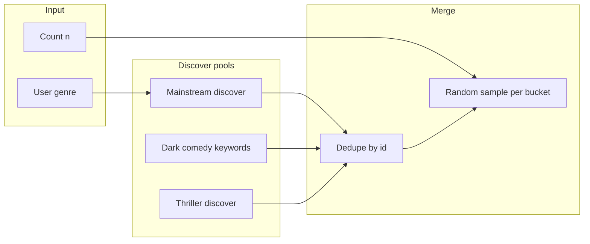

# Blend mainstream + alternative (dark comedy / thriller) with random sampling

## Current behavior ([Movie_selector.py](c:\Users\DaGra\Builds\Movies_Selector\Movie_selector.py))

- Single discover call: `with_genres={user_genre}`, `vote_count` between 50 and 300, `sort_by=vote_average.desc`.
- Output uses `df.head(num_movies)` — always the same “top of first page” titles, **not** random.
- You already sketched dark-comedy keyword IDs in comments (`612`, `10183`, `9717`); TMDB discover supports **OR** for `with_keywords` using `|` (comma is AND).

## Target behavior

1. **Split the requested count** into buckets, e.g. `mainstream_share` + `alternative_share` (defaults like 40% / 60% or configurable constants / optional third input).
2. **Mainstream pool**: Same user genre (or optional “any” if you add it later), **relax** the indie ceiling — e.g. `vote_count.gte=200` (or 500), no low `vote_count.lte`, `sort_by=popularity.desc` or `vote_average.desc`, use **`page=random.randint(1, min(total_pages, cap))`** after reading `total_pages` from the first response (TMDB caps total pages at 500; stay within API rules).
3. **Alternative — dark comedy**: `discover` with `with_keywords=612|10183|9717` (or a subset), optionally intersect with user genre via `with_genres={genre_id}` if you want “dark comedy within their pick”; use a **mid popularity / mid vote_count** band or `sort_by=popularity.asc` on a random page to avoid only blockbusters.
4. **Alternative — thriller**: `with_genres=53` (Thriller), same “niche” parameters as above; optional second query `with_genres=35,53` (Comedy **and** Thriller) for a sharper “dark comedy adjacent” slice — TMDB uses comma for AND between genres.
5. **Random selection**: For each pool, collect enough candidates (multiple pages if needed), **dedupe by TMDB `id`** (you will need to store `id` in the DataFrame or a dict), then `random.sample` (or shuffle + take) to fill each bucket. Concatenate buckets; if still short after dedupe, backfill from any pool with a fallback discover.
6. **Output**: Keep columns users care about (title, year, rating, popularity); optionally add `Source` (`mainstream` / `dark_keywords` / `thriller`) for transparency.

## Code structure (minimal refactor)

- Extract **`discover_movies(params: dict) -> tuple[list[dict], int]`** (or similar) that performs the GET and returns normalized movie dicts + `total_pages` from the JSON.
- Add **`fetch_pool(kind, genre_id, page, **overrides)`** that builds query strings for mainstream vs keyword vs thriller.
- Replace **`fetch_indie_movies`** with **`build_mixed_recommendations(genre_id, num_movies, rng)`** returning a single DataFrame.
- Use Python’s **`random.Random`** (or `secrets` for page choice if you prefer) so behavior is testable.

## Security / hygiene (recommended)

- Move `TMDB_TOKEN` to an environment variable (e.g. `TMDB_READ_ACCESS_TOKEN`) and read via `os.environ`; avoid committing tokens (the current file contains a live bearer token).

## Validation

- Manually run with a few genres and counts; confirm titles differ across runs and that some picks are clearly higher-popularity while others are lower-popularity / keyword-driven.
- Optionally verify keyword IDs still match “dark comedy / satire / black comedy” via TMDB keyword search if any query returns thin results.

## Files touched

- Only [Movie_selector.py](c:\Users\DaGra\Builds\Movies_Selector\Movie_selector.py) unless you add `requirements.txt` or `.env.example` (optional; skip unless you want env documentation).
